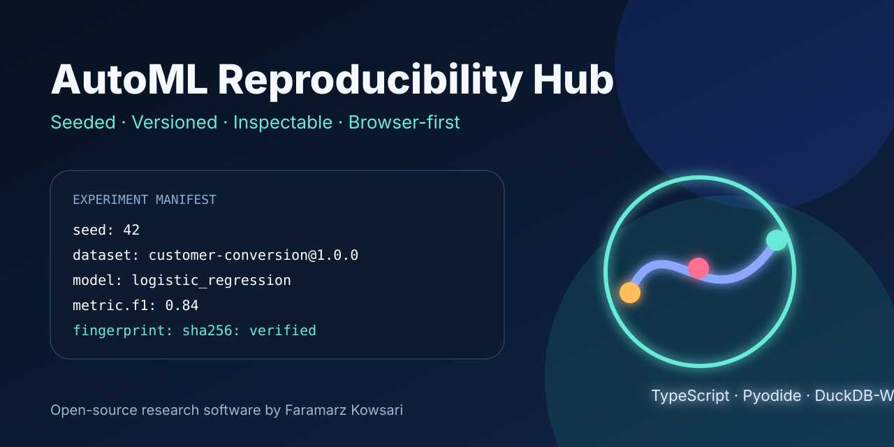
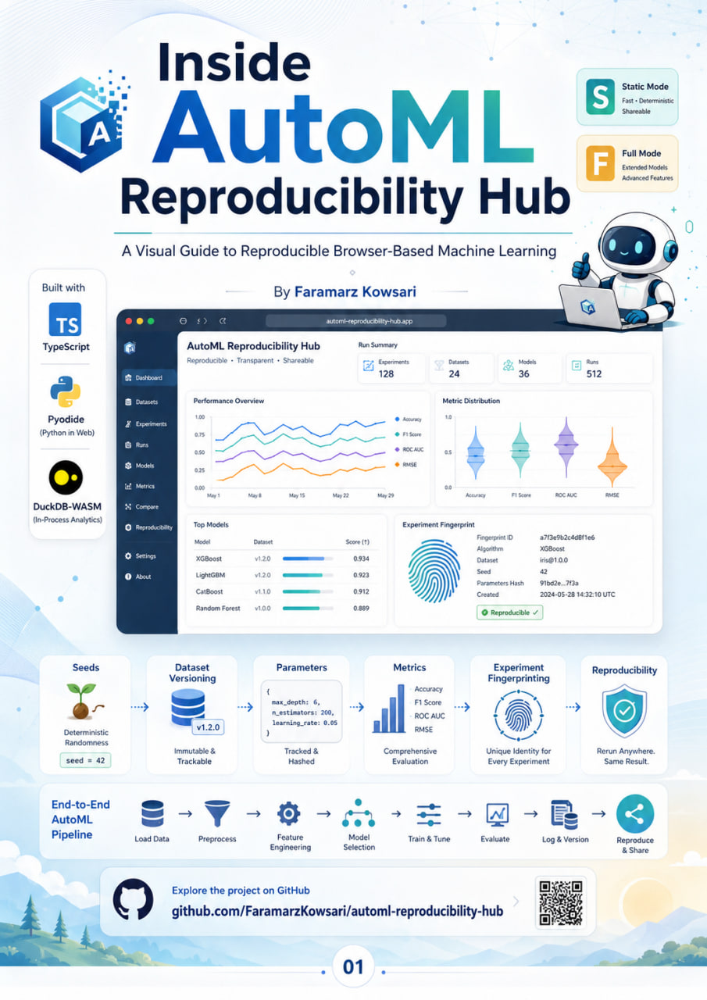

<div align="center">
  

# AutoML Reproducibility Hub

### Reproduce the experiment, not just the score.

[](https://github.com/FaramarzKowsari/automl-reproducibility-hub/actions/workflows/ci.yml)
[](https://github.com/FaramarzKowsari/automl-reproducibility-hub/actions/workflows/deploy-pages.yml)
[](LICENSE)
[](https://www.typescriptlang.org/)
[](https://pyodide.org/)
[](https://duckdb.org/docs/stable/clients/wasm/overview)

**Live application:** `https://FaramarzKowsari.github.io/automl-reproducibility-hub/`

</div>

<p align="center"></p>

## Official infographic guidebook

<p align="center">
  <a href="https://faramarzkowsari.github.io/automl-reproducibility-hub/guidebook/" title="Read the official AutoML Reproducibility Hub guidebook">
    
  </a>
</p>

<p align="center">
  <strong>Inside AutoML Reproducibility Hub</strong><br />
  <em>A Visual Guide to Reproducible Browser-Based Machine Learning</em>
</p>

This ten-page A4 infographic handbook is the official visual companion to the repository. It explains the project from purpose to deployment: the reproducibility problem in machine learning, the TypeScript/Pyodide/DuckDB-WASM architecture, Static and Full execution modes, the experiment lifecycle, dataset versions and SHA-256 fingerprints, manifests, metrics, model comparison, privacy boundaries, research value, and publication readiness.

- [Read the dedicated guidebook page](https://faramarzkowsari.github.io/automl-reproducibility-hub/guidebook/)
- [Open or download the PDF](https://faramarzkowsari.github.io/automl-reproducibility-hub/guidebook/inside-automl-reproducibility-hub.pdf)
- [View the PDF inside the repository](public/guidebook/inside-automl-reproducibility-hub.pdf)
- [Read the guidebook documentation](docs/GUIDEBOOK.md)

AutoML Reproducibility Hub is a browser-first research and educational laboratory for creating, inspecting, exporting, and rerunning machine-learning experiments as explicit reproducibility contracts.

A result is not treated as a detached metric. Every run binds together:

- deterministic random seed;
- dataset name, semantic version, and SHA-256 fingerprint;
- target column and task type;
- train/test split;
- preprocessing pipeline;
- selected algorithm and all exposed parameters;
- task-appropriate metrics;
- Python, Pyodide, pandas, NumPy, scikit-learn, DuckDB-WASM, and application versions;
- exportable manifest and Python reproduction skeleton.

## S + F execution modes

### S — Static Reference Mode

Loads versioned, precomputed reference experiments without pretending that a model was executed. It is useful for instant demos, teaching, screenshots, and environments where large WebAssembly packages cannot be downloaded.

### F — Full Browser Mode

Runs the real experiment in the browser:

1. DuckDB-WASM reads and profiles the CSV.
2. Pyodide loads NumPy, pandas, and scikit-learn.
3. A deterministic preprocessing and model pipeline is trained.
4. Classification or regression metrics are calculated.
5. A cryptographically fingerprinted manifest is produced.

No project-owned server, database, paid API, or embedded credential is required.

## Included experiments

- Customer Conversion v1.0.0 — binary classification.
- Revenue Forecast v1.0.0 — regression.
- Logistic Regression and Random Forest classification.
- Linear Regression and Random Forest regression.
- Compact AutoML comparison across compatible candidate models.
- User CSV upload with client-side hashing and profiling.

## Run locally

```bash
npm install
npm run dev
```

Production checks:

```bash
npm run test
npm run build
```

## Repository structure

```text
automl-reproducibility-hub/
├── public/
│   ├── datasets/             # versioned CSV fixtures and catalog
│   ├── fixtures/             # labeled Static-mode reference runs
│   ├── guidebook/            # official PDF, cover, and landing page
│   └── images/               # repository/social artwork
├── src/
│   ├── components/           # experiment, metrics, manifest, history, author UI
│   ├── data/                 # model catalog and pinned runtime versions
│   ├── lib/                  # hashing, DuckDB, storage, manifests, downloads
│   └── workers/              # isolated Pyodide/scikit-learn execution
├── docs/
│   ├── GUIDEBOOK.md          # guidebook contents, paths, and citation guidance
│   └── ...                   # architecture and scientific limitations
└── .github/workflows/        # CI and GitHub Pages deployment
```

## Scientific boundaries

Matching a seed is necessary but not always sufficient for bit-for-bit equality across browsers, WebAssembly engines, floating-point libraries, and package versions. The application records those boundaries instead of hiding them. See [Methodology](docs/METHODOLOGY.md) and [Reproducibility contract](docs/REPRODUCIBILITY.md).

## Author

**Faramarz Kowsari** is an author, Software Engineer and AI researcher based in Istanbul. He works across Artificial Intelligence, prompt engineering, data and trading systems, education technology, classical literature, and mindfulness. He develops browser-based educational software and specialized instructional content.

- ORCID: https://orcid.org/0000-0003-1692-0453
- Google Scholar: https://scholar.google.com/citations?user=G7tP5WMAAAAJ&hl=en
- GitHub: https://github.com/FaramarzKowsari
- LinkedIn: https://www.linkedin.com/in/faramarzkowsari
- Official Website: https://FaramarzKowsari.github.io
- Zenodo: https://zenodo.org/search?q=creators.orcid%3A%220000-0003-1692-0453%22

## Citation

Machine-readable citation metadata is available in [`CITATION.cff`](CITATION.cff). A DOI has intentionally not been invented; create a GitHub Release and let Zenodo issue the official identifier.

## License

MIT © 2026 Faramarz Kowsari.
